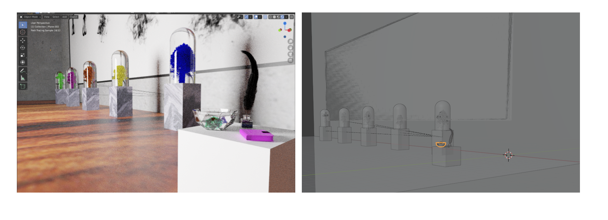

<!-- pbrt, Version 3 (Go to pdf_folder/Final_Report.pdf to see project details)
===============

[](https://travis-ci.org/mmp/pbrt-v3)
[](https://ci.appveyor.com/project/mmp/pbrt-v3/branch/master)

This repository holds the source code to the version of pbrt that is
described in the third edition of *Physically Based Rendering: From
Theory to Implementation*, by [Matt Pharr](http://pharr.org/matt), [Wenzel
Jakob](http://www.mitsuba-renderer.org/~wenzel/), and Greg Humphreys.  As
before, the code is available under the BSD license.

The [pbrt website](http://pbrt.org) has general information about both the
*Physically Based Rendering* book as well as many other resources for pbrt.
As of October 2018, the full [text of the book](http://www.pbr-book.org) is
now available online, for free.

Example scenes
--------------

Over 8GB of example scenes are available for download. (Many are new and
weren't available with previous versions of pbrt.)  See the [pbrt-v3 scenes
page](http://pbrt.org/scenes-v3.html) on the pbrt website for information
about how to download them.

After downloading them, see the `README.md.html` file in the scene
distribution for more information about the scenes and preview images.

Additional resources
--------------------

* There is a [pbrt Google
  Groups](https://groups.google.com/forum/#!forum/pbrt) mailing list that can
  be a helpful resource.
* Please see the [User's Guide](http://pbrt.org/users-guide.html) for more
  information about how to check out and build the system as well as various
  additional information about working with pbrt.
* Should you find a bug in pbrt, please report it in the [bug
  tracker](https://github.com/mmp/pbrt-v3/issues).
* Please report any errors you find in the *Physically Based Rendering*
  book to authors@pbrt.org.

Note: we tend to let bug reports and book errata emails pile up for a few
months for processing them in batches. Don't think we don't appreciate
them. :-)

Building pbrt
-------------

To check out pbrt together with all dependencies, be sure to use the
`--recursive` flag when cloning the repository, i.e.
```bash
$ git clone --recursive https://github.com/mmp/pbrt-v3/
```
If you accidentally already cloned pbrt without this flag (or to update an
pbrt source tree after a new submodule has been added, run the following
command to also fetch the dependencies:
```bash
$ git submodule update --init --recursive
```

pbrt uses [cmake](http://www.cmake.org/) for its build system.  On Linux
and OS X, cmake is available via most package management systems.  To get
cmake for Windows, or to build it from source, see the [cmake downloads
page](http://www.cmake.org/download/).  Once you have cmake, the next step
depends on your operating system.

### Makefile builds (Linux, other Unixes, and Mac) ###

Create a new directory for the build, change to that directory, and run
`cmake [path to pbrt-v3]`. A Makefile will be created in the current
directory.  Next, run `make` to build pbrt, the obj2pbrt and imgtool
utilities, and an executable that runs pbrt's unit tests.  Depending on the
number of cores in your system, you will probably want to supply make with
the `-j` parameter to specify the number of compilation jobs to run in
parallel (e.g. `make -j8`).

By default, the makefiles that are created that will compile an optimized
release build of pbrt. These builds give the highest performance when
rendering, but many runtime checks are disabled in these builds and
optimized builds are generally difficult to trace in a debugger.

To build a debug version of pbrt, set the `CMAKE_BUILD_TYPE` flag to
`Debug` when you run cmake to create build files to make a debug build.  To
do so, provide cmake with the argument `-DCMAKE_BUILD_TYPE=Debug` and build
pbrt using the resulting makefiles. (You may want to keep two build
directories, one for release builds and one for debug builds, so that you
don't need to switch back and forth.)

Debug versions of the system run much more slowly than release
builds. Therefore, in order to avoid surprisingly slow renders when
debugging support isn't desired, debug versions of pbrt print a banner
message indicating that they were built for debugging at startup time.

### Xcode ###

To make an Xcode project on OS X, run `cmake -G Xcode [path to pbrt-v3]`.
A `PBRT-V3.xcodeproj` project file that can be opened in Xcode.  Note that
the default build settings have an optimization level of "None"; you'll
almost certainly want to choose "Faster" or "Fastest".

### MSVC on Windows ###

On Windows, first point the cmake GUI at the directory with pbrt's source
code.  Create a separate directory to hold the result of the build
(potentially just a directory named "build" inside the pbrt-v3 directory)
and set that for "Where to build the binaries" in the GUI.

Next, click "Configure".  Note that you will want to choose the "Win64"
generator for your MSVC installation unless you have a clear reason to need
a 32-bit build of pbrt.  Once cmake has finished the configuration step,
click "Generate"; when that's done, there will be a "PBRT-V3.sln" file in
the build directory you specified. Open that up in MSVC and you're ready to
go.

### Build Configurations ###

There are two configuration settings that must be set when configuring the
build. The first controls whether pbrt uses 32-bit or 64-bit values for
floating-point computation, and the second controls whether tristimulus RGB
values or sampled spectral values are used for rendering.  (Both of these
aren't amenable to being chosen at runtime, but must be determined at
compile time for efficiency).  The cmake configuration variables
`PBRT_FLOAT_AS_DOUBLE` and `PBRT_SAMPLED_SPECTRUM` configure them,
respectively.

If you're using a GUI version of cmake, those settings should be available
in the list of configuration variables; set them as desired before choosing
'Generate'.

With command-line cmake, their values can be specified when you cmake via
`-DPBRT_FLOAT_AS_DOUBLE=1`, for example.
 -->


# Dye Drop Rendering 

by **Samaksh (Avi) Goyal (sagoyal), Ian Madden (iamadden)**. Implemented in [PBRT](https://github.com/mmp/pbrt-v3)


## Inspiration
The dye drop is a beautiful creation that is often the subject of many desktop backgrounds, artwork, and more. It is also a culmination of several unique and complex fluid dynamical processes, diffusion and turbulence, so the setup of the modeling problem was already very challenging. The material properties of the dye in water is also important: acrylic paint can be shot in a jet-like fashion to have one effect, while a more diffuse, water-color ink drop has an entirely different effect. Our aim was to render this image effectively using the principle of volumetric photon scattering. This would allow us to see the unique behaviors of the medium in scattering light. We hoped that this would generate a few caustic effects, with some coloring effects as well. Finally, we wanted to set this beautiful imagery in the place we believed such an image would properly belong: a modern art exhibition.


## Exhibit Hall

We imagine an exhibit of acrylic paint jets being pushed into a chamber of water in an art museum, while at the near corner, we see a quill dipped in a bottle of ink. We see a drop of dye from the quill diffusing in the glass bowl, and a journal for use of the writing. We did not focus on the minute features of the feather, but rather the volumetric effects of these fluids diffusing in water.



## Ink Splash Scene
In order to model the splash of ink in the nearby bowl, we discretized the liquid into tiny individual particles, and modeled diffusion through addition of Brownian Motion (acting as a diffusive force), a low gravity (some downward force, but counteracted by a buoyant force), and finally turbulence (to represent the vorticity and the resistance of the water upon the splash. After the simulation with $N = 10^7$ particles, we created a mesh by convolution over the many particles to generate the following model.

We then moved on to creating the other objects of the scene:

 - **Bowl.** To model the bowl, we took a convex polyhedron and cut the polyhedron and half, created a shell, and filled with water by using a similar polyhedron.
 - **Quill** We modeled a low order Bezier curve, and then used Blender's particle modelling features to grow "hairs". After this, we created a mesh by adding some radius to the hairs.
 -  **Inkwell** We modeled the inkwell with a cylinder mated to a cube, with some smoothing and remeshing in order to create the appearance.
 - **Journal** The model of a journal was borrowed and downloaded (free) courtesy of TurboSquid, "Pen and Journal."


## Smoke Vorticity
We developed the large-scale image of the smoke in the scene by running a longer simulation of smoke (with diffusive and Brownian effects, as well as vorticity) [1]. We created a 2D image through this, and developed the painting through placement on a plane as a 2D texture.


## Paint Jet Through Water
In order to model the paint jet pushing through the water, we actually combined the knowledge of smoke and ink drop. The model of water was still based on a discretization into particles, and the same turbulence addition still applied. However, the rising behavior was inherited through a "forcing" through the smoke simulation.

## Volumetric Photon Mapping Implementation


We implemented volumetric photon mapping to make the realistic lighting effects of light scattering in the glass bowl with a scatting liquid inside. We drew inspiration from significant prior work on the subject [2, 3]. Our implementation concatenates the stochastic progressive photon mapping (SPPM) integrator found in PBRT `sppm.cpp/h` and the volumetric path tracing routine `volpath.cpp/h`. 


For reference we provide an image of a glass teapot with tea inside with just SPPM integration (top left) and with just Volume scattering (bottom left). The scene pbrt file was graciously made available by [Benedikt Bitterli](https://benedikt-bitterli.me/resources/).

Our implementation is in `sppmvol.cpp/h`. We add volume scattering to both phases of the current SPPM implementation. In the first phase of SPPM when the camera ray path deposits visible points on the surface, we insert the main for loop in volpath.cpp to handling scattering at point in medium. This way we can sample in-scattered visible points inside the medium. This addition is visible in the top right image of the figure. The tea has color now because of the scatter effect.

During the second phase of SPPM when we are shooting rays from the light source we need to intersect the photons with the volume medium (so that accumulation can occur). To do so when we hit a volume we calculate the scattering at the point of intersection and then shoot a new photon in the sampled direction. This is visible in the bottom right image of the figure.

We would like to thank the Xianzhe Zhang, Wen Zhou (CS348B class of 2019) for their provided explainations of the above process - this made debugging easier.


# Final Render


Render Parameters:

The full resolution is 1900 x 1400, with 2048 halton samples per pixel, 15000 camera iterations and 1000000 photon iterations.
and 2048 volumetric sppm integrater numiterations.


## Trouble Shooting
We ran into several problems along the way:

- We had trouble rendering our high resolution image in a reasonable amount of time locally so we shifted an AWS EC2 instance with `96` virtual cores.
-  We were unable to render images with `10k+` camera ray iterations, so to overcome with Matt suggested we take advantage of the `cropwindow` argument on the `Film` attribute and use `imagtool assemble` to gather cropped images. This idea worked perfectly.
- The radius parameter was especially tricky to set accurately in our `sppmvol.cpp/h` implementation. We found that an initial condition of `radius = 0.2` gave the best results.
- There were many issues with accurate fluid simulation, and porting this over to PBRT. Because there was no clear way to take advantage of the "GridDensityMedium" that was used in other implementations of smoke. As a result, it was necessary to generate a mesh through blender instead of using a density. This necessitated the use of a discretized particle view of liquid and smoke rather than a density view. Material properties, as a result, also had to be done manually as well.


## Distribution of Work

We were both equally involved in the scene setup, story-boarding and implementation of rendering strategies. We meet collaboratively on long zoom calls.

Ian Madden: Set up Blender scene, fluid simulation and meshing, material properties, and camera settings

Samaksh (Avi) Goyal: Implemented volumetric photon mapping, set up AWS to render image, advised in scene development, set scattering coefficents

[Code](https://github.com/sagoyal2/DyeDrop)

## Sources
[1] Kim, T., Thürey, N., James, D., & Gross, M. (2008). Wavelet turbulence for fluid simulation. _ACM Transactions on Graphics (TOG)_, _27_(3), 1-6.

[2] Henrik Wann Jensen. 2001. Realistic Image Synthesis Using Photon Mapping. A. K. Peters, Ltd., Natick, MA,
USA.

[3] Jensen, Henrik Wann, and Per H. Christensen. "Efficient simulation of light transport in scenes with
participating media using photon maps." Proceedings of the 25th annual conference on Computer graphics
and interactive techniques. ACM, 1998


> Written with the help of [StackEdit](https://stackedit.io/).
